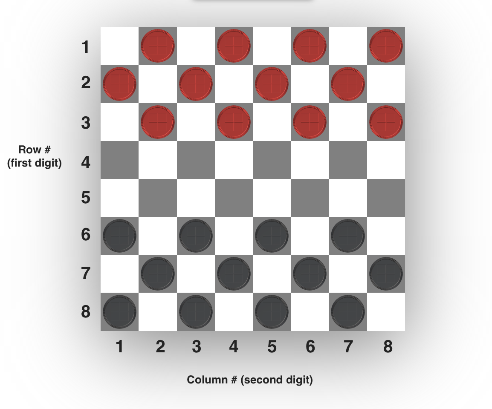

Readme - Checkers

1) “gamePlayListener" event listener is added to the entire board (waiting for click event). When clicked, the “gamePlay” function is called.

2) "resetGlobalData" method is called, setting all values back to null in preparation for the new move. 

3) The “justJumped” variable, which is referenced when determining whether or not a double, triple, etc. jump can be performed, is set back to false.

4) The piece clicked is stored in the "pieceSelected" variable. This is an HTML element containing an ID that represents the space location on the board. 

Example: ID = ”8-1” (8th row from the top, 1st column from the left)

5) The “playerPiecesArray” is searched for a piece object with a location ID that matches the “pieceSelected” variable. Once located, it is stored in the “identifiedPiece” variable.

6) If the “identifiedPiece” object’s “assignedPlayer” matches the current “activePlayer”, the possible move spaces are calculated using the “identifyMoveSpaces” method, and stored in 4 possible separate variables.

7) The identified spaces are reviewed to determine if they are valid space options for the player to move to. (Does space exist? Is there a piece there? If so, which player is that piece assigned to? etc.) Valid spaces are then stored in 4 possible separate variables. (potentialMove, potentialMove2, and so on)

8) If no valid/potential moves are identified, the gamePlayListener function expression starts over. This allows the player to attempt a different selection.

9) All potential move spaces that are not null have the class “spaceGlow” added to them, which highlights them in yellow.

10) Event listeners are added to potential move spaces. When clicked, a “moveToSpace” method (part of the “identifiedPiece” object), is called. This updates the location of the piece, moves the piece image, removes spaceGlow, and removes active event listeners.

11) Each player’s points (represents number of remaining pieces) are checked to determine if there is a winner. If there is no winner, the active player is switched, and the game continues (“gamePlay” function called and we go back to step 1).

